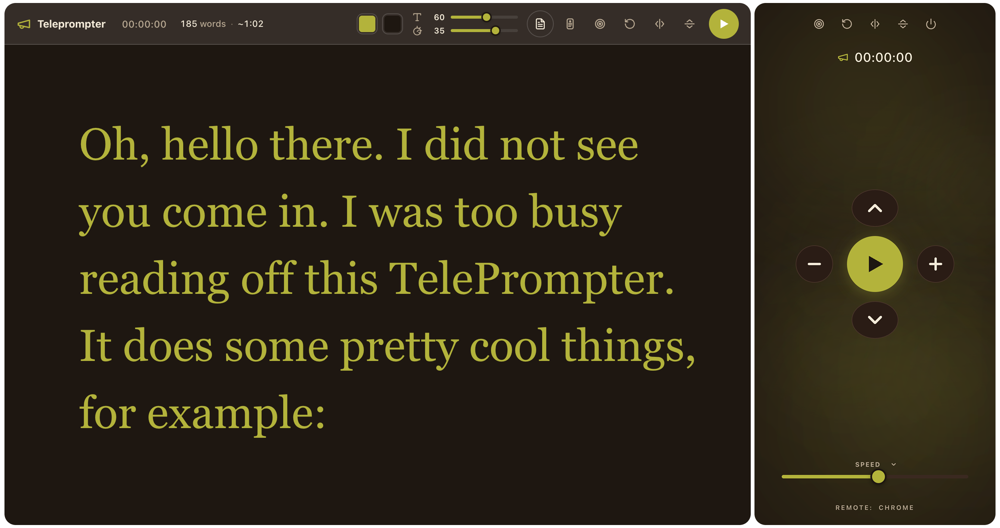

# TelePrompter

> Browser-based teleprompter with remote control. No install, no sign-up — just open the link, paste your script, and read.

<p align="center">
  <a href="https://legenki.github.io/teleprompter/">
    
  </a>
</p>

<p align="center">
  <sub>Open <a href="https://legenki.github.io/teleprompter/"><b>legenki.github.io/teleprompter</b></a> — works on desktop, tablet, and phone.</sub>
</p>



---

## Features

- **Edit in the browser** — `contenteditable` text area, paste from Word / Google Docs and the line breaks get cleaned up automatically.
- **Auto-save** — your script and settings are kept in `localStorage`, so a refresh doesn't lose your work.
- **Multiple drafts** — save several scripts and switch between them from the sidebar.
- **Word count + reading time estimate** — based on the current speed setting.
- **3-2-1 countdown** before play, so you can sit down in front of the camera.
- **Reading focus mode** — dims the top and bottom of the screen and highlights the current reading band.
- **Remote control** — run the prompter on a laptop and drive it from your phone over Wi-Fi.
- **Custom colors** — pick any text and background color; the whole UI re-skins to match.
- **Keyboard shortcuts** + presentation-remote support.
- **PWA** — installable, works offline once loaded.

## Keyboard shortcuts

| Key | Alternatives | Action |
|:---:|:---:|:---|
| <kbd>↑</kbd> | | Increase font size |
| <kbd>↓</kbd> | | Decrease font size |
| <kbd>←</kbd> | <kbd>PgUp</kbd> | Slow down |
| <kbd>→</kbd> | <kbd>PgDn</kbd> | Speed up |
| <kbd>Space</kbd> | <kbd>B</kbd> · <kbd>F5</kbd> · <kbd>.</kbd> | Play / Pause |
| <kbd>Esc</kbd> | | Reset |

---

## How the remote control works

The remote is just a second browser window pointed at `/remote`. The two windows talk to each other through a tiny Socket.IO server that joins them in a private "room" identified by a 6-character code.

```
┌─────────────────────────┐                                ┌─────────────────────────┐
│   Main app              │                                │   Remote (phone)        │
│   index.html            │                                │   /remote.html          │
│   TelePrompter          │                                │   TelePrompterRemote    │
└────────────┬────────────┘                                └────────────┬────────────┘
             │                                                          │
             │  1. Click the Remote icon                                │
             │     → socket.emit('connectToRemote', 'REMOTE_ABC123')    │
             │                                                          │
             │  2. Modal shows the QR + 6-char code                     │
             │                                                          │
             │              ┌─────────────────────┐                     │
             │              │   Socket.IO server  │                     │
             │              │   server.js  :3000  │                     │
             │              └──────────┬──────────┘                     │
             │                         │                                │
             │                         │  Creates / joins room          │
             │                         │  REMOTE_ABC123                 │
             │                         │                                │
             │                         │  3. Open /remote on phone,     │
             │                         │     enter the code ABC123      │
             │                         │  ←── connectToRemote           │
             │                         │                                │
             │                         │  4. Both clients now share     │
             │                         │     one room                   │
             │                         │                                │
             │  ←── connectedToRemote(id) ───────────────────────────→  │
             │                                                          │
             │                                                          │
             │  5. User taps Play on the phone                          │
             │  ←──── sendRemoteControl('play') ─────────────────────── │
             │                                                          │
             │  6. Main window triggers $play.click()                   │
             │                                                          │
             │  7. Main window broadcasts state back so the phone       │
             │     can mirror the timer / play state / live config      │
             │  ──── clientCommand('play' | 'stop' | 'updateTime'       │
             │                       | 'updateConfig') ───────────────→ │
             │                                                          │
```

**TL;DR**

1. The main app generates a 6-char code (`ABC123`) and shows a QR.
2. Open `/remote` on a second device, type the code (or scan the QR).
3. The Socket.IO server joins both clients into the same room.
4. Buttons on the phone (`play`, `up/down`, `slower/faster`, `flip`, `reset`) emit commands; the main window executes them.
5. The main window emits its state back so the phone stays in sync (timer, play/pause, font size, scroll position).

The connection itself is unencrypted Socket.IO — fine for a local network, **put it behind an HTTPS reverse proxy if exposing on the public internet** (see [DEVELOPERS.md](DEVELOPERS.md) for an Nginx example).

---

## Run it yourself

```bash
git clone https://github.com/legenki/teleprompter.git
cd teleprompter
npm install
npm run server         # starts the Socket.IO server on :3000
```

Then open [http://localhost:3000](http://localhost:3000).

For the public hosted build, see the [Launch button](https://legenki.github.io/teleprompter/) above. Setup details, Docker, and reverse-proxy configs live in [DEVELOPERS.md](DEVELOPERS.md).

## License

MIT — see [LICENSE](LICENSE).

Original work © Peter Schmalfeldt ([manifestinteractive/teleprompter](https://github.com/manifestinteractive/teleprompter)).
This fork by [Andy Legenki](https://github.com/legenki).
