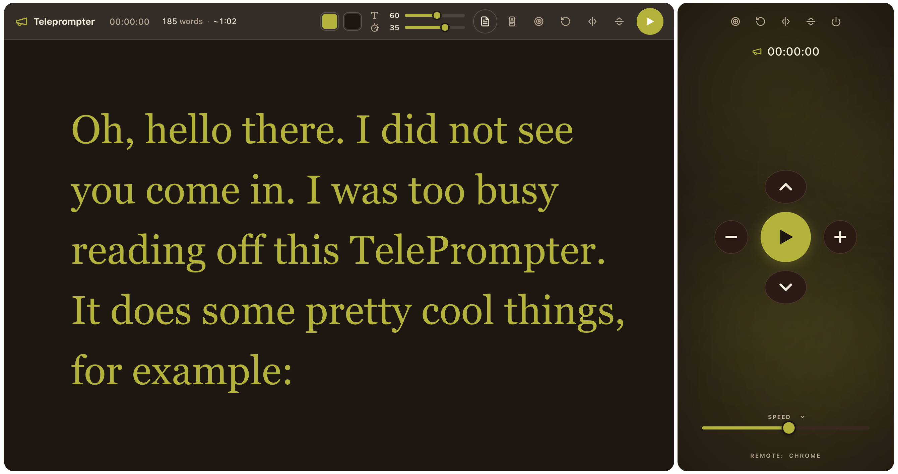

# TelePrompter

> Browser-based teleprompter with remote control. No install, no sign-up — just open the link, paste your script, and read.

<p align="center">
  <a href="https://legenki.github.io/teleprompter/">
    
  </a>
</p>

<p align="center">
  <sub>Open <a href="https://legenki.github.io/teleprompter/"><b>legenki.github.io/teleprompter</b></a> — works on desktop, tablet, and phone.</sub>
</p>



---

## Features

- **Edit in the browser** — `contenteditable` text area, paste from Word / Google Docs and the line breaks get cleaned up automatically.
- **Auto-save** — your script and settings are kept in `localStorage`, so a refresh doesn't lose your work.
- **Multiple drafts** — save several scripts and switch between them from the sidebar.
- **Word count + reading time estimate** — based on the current speed setting.
- **3-2-1 countdown** before play, so you can sit down in front of the camera.
- **Reading focus mode** — dims the top and bottom of the screen and highlights the current reading band.
- **Remote control** — run the prompter on a laptop and drive it from your phone over Wi-Fi.
- **Custom colors** — pick any text and background color; the whole UI re-skins to match.
- **Keyboard shortcuts** + presentation-remote support.
- **Modern Architecture** — fully refactored into ES6 Modules with a centralized reactive state store (Pub/Sub pattern). No more messy jQuery UI plugins.
- **PWA** — installable, works offline once loaded.

## Keyboard shortcuts

| Key | Alternatives | Action |
|:---:|:---:|:---|
| <kbd>↑</kbd> | | Increase font size |
| <kbd>↓</kbd> | | Decrease font size |
| <kbd>←</kbd> | <kbd>PgUp</kbd> | Slow down |
| <kbd>→</kbd> | <kbd>PgDn</kbd> | Speed up |
| <kbd>Space</kbd> | <kbd>B</kbd> · <kbd>F5</kbd> · <kbd>.</kbd> | Play / Pause |
| <kbd>Esc</kbd> | | Reset |

---

## How the remote control works

The remote is just a second browser window pointed at `/remote`. The two windows talk to each other through a tiny Socket.IO server that joins them in a private "room" identified by a 6-character code.

```
┌─────────────────────────┐                                ┌─────────────────────────┐
│   Main app              │                                │   Remote (phone)        │
│   index.html            │                                │   /remote.html          │
│   assets/js/app.js      │                                │   assets/js/remote-app.js│
└────────────┬────────────┘                                └────────────┬────────────┘
             │                                                          │
             │  1. Click the Remote icon                                │
             │     → socket.emit('connectToRemote', 'REMOTE_ABC123')    │
             │                                                          │
             │  2. Modal shows the QR + 6-char code                     │
             │                                                          │
             │              ┌─────────────────────┐                     │
             │              │   Socket.IO server  │                     │
             │              │   server.js  :3000  │                     │
             │              └──────────┬──────────┘                     │
             │                         │                                │
             │                         │  Creates / joins room          │
             │                         │  REMOTE_ABC123                 │
             │                         │                                │
             │                         │  3. Open /remote on phone,     │
             │                         │     enter the code ABC123      │
             │                         │  ←── connectToRemote           │
             │                         │                                │
             │                         │  4. Both clients now share     │
             │                         │     one room                   │
             │                         │                                │
             │  ←── connectedToRemote(id) ───────────────────────────→  │
             │                                                          │
             │                                                          │
             │  5. User taps Play on the phone                          │
             │  ←──── sendRemoteControl('play') ─────────────────────── │
             │                                                          │
             │  6. Main window triggers $play.click()                   │
             │                                                          │
             │  7. Main window broadcasts state back so the phone       │
             │     can mirror the timer / play state / live config      │
             │  ──── clientCommand('play' | 'stop' | 'updateTime'       │
             │                       | 'updateConfig') ───────────────→ │
             │                                                          │
```

**TL;DR**

1. The main app generates a 6-char code (`ABC123`) and shows a QR.
2. Open `/remote` on a second device, type the code (or scan the QR).
3. The Socket.IO server joins both clients into the same room.
4. Buttons on the phone (`play`, `up/down`, `slower/faster`, `flip`, `reset`) emit commands; the main window executes them.
5. The main window emits its state back so the phone stays in sync (timer, play/pause, font size, scroll position).

The connection itself is unencrypted Socket.IO — fine for a local network, **put it behind an HTTPS reverse proxy if exposing on the public internet** (see [DEVELOPERS.md](DEVELOPERS.md) for an Nginx example).

---

## Run it yourself

```bash
git clone https://github.com/legenki/teleprompter.git
cd teleprompter
npm install
npm run server         # starts the Socket.IO server on :3000
```

Then open [http://localhost:3000](http://localhost:3000).

For the public hosted build, see the [Launch button](https://legenki.github.io/teleprompter/) above. Setup details, Docker, and reverse-proxy configs live in [DEVELOPERS.md](DEVELOPERS.md).

## License

MIT — see [LICENSE](LICENSE).

Original work © Peter Schmalfeldt ([manifestinteractive/teleprompter](https://github.com/manifestinteractive/teleprompter)).
This fork by [Andy Legenki](https://github.com/legenki).

## Interview Copilot (Chrome extension)

The extension opens a side panel that listens to the audio of the current browser tab (Google Meet, Zoom Web, Teams Web…),
transcribes it, shows a Russian translation of what the interviewer says and suggests 3 short answers plus key points, based on
your resume and the job description. Answers come from Gemini; speech recognition runs on-device (Whisper) or through Gemini.

```bash
npm install --ignore-scripts   # onnxruntime-node's postinstall is not needed in the browser
npm run build:ext              # then load dist/extension via chrome://extensions → Load unpacked
npm test                       # unit tests for segmentation / question detection / prompts / phone relay
```

1. Open the call tab, click the extension icon on it (this grants tab-capture access) and press **Start**. The keyboard icon in the header opens a field for typing a question by hand (handy for testing the answers without audio).
2. **Settings** (top right): paste a free Gemini API key (aistudio.google.com/apikey), your resume and the vacancy.
   Answers use `gemini-3.5-flash-lite` by default (generous free limits; check yours in AI Studio → rate limits).
   Gemini 3.x models cannot switch thinking off, so the request omits `thinkingBudget` and `temperature` for them.
3. **Languages** are two switches under the header: *Interviewer* (EN / ES) and *Answers* (EN / ES / RU). The Russian
   translation line is always shown. Changing the interviewer language while listening stops it; press Start again.
   Spanish uses the multilingual Whisper `small` model (more accurate, slower on CPU) and English uses `base`.
4. **Speech recognition → Gemini** is more accurate but sends the call audio to Google (on the free tier Google may use it to
   improve its products). It uses `gemini-2.5-flash-lite`, whose audio input is documented, and waits for longer pauses to save quota and falls back to on-device Whisper automatically on
   401/403/429. On-device stays the default. Whisper runs in a Web Worker, so the UI never freezes.
5. Click an answer to copy it. The light or dark theme follows the system.

Only tab audio is captured (the desktop Zoom/Teams apps are not). The API key is stored in `chrome.storage.local`. Whisper
models are downloaded from huggingface.co on first use. Check the interviewer's / employer's rules on AI assistance first.

### Firefox version

```bash
npm run build:firefox   # -> dist/firefox, load via about:debugging → This Firefox → Load Temporary Add-on → manifest.json
```

Firefox cannot capture tab audio, so the call audio goes through a **virtual audio cable**
(BlackHole on macOS, VB-Cable on Windows, a PipeWire/Pulse monitor on Linux):

1. Route the call output to the cable. On macOS create a *Multi-Output Device* (speakers + BlackHole) in
   Audio MIDI Setup and select it as the system output, so you still hear the interviewer.
2. Open the sidebar → Settings → *Audio source* → the refresh icon (grants microphone access) and pick the cable
   (auto-detected if its name contains BlackHole / VB-Cable / Loopback).
3. Press **Start**.

In Firefox speech recognition runs in the sidebar page itself (CPU unless WebGPU is available). Closing the sidebar stops listening.

### Phone as a second screen (iPhone / any phone browser)

iOS apps cannot hear another app's audio, so the phone is a *display*: the computer does the listening and the
phone shows the Russian translation, key points and answer options.

```bash
npm run phone     # on the computer running the extension; prints a pairing token and phone links
```

1. Extension → Settings → **Phone display**: switch it on, relay `localhost:3100`, paste the token.
2. On the phone (same Wi-Fi) open the `http://<computer-ip>:3100/?t=<token>` link printed by the command.
   Newest card is on top; `A−/A+` change the text size. The page reconnects by itself and replays recent cards.
3. Set the phone's Auto-Lock to *Never* while interviewing (Settings → Display & Brightness). Browsers only
   allow the screen Wake Lock over HTTPS, and this relay is plain HTTP on your local network.

Security: the relay listens on all interfaces (`COPILOT_HOST=127.0.0.1` restricts it to this computer) and the token is the
only protection; traffic is not encrypted. Use a network you trust, not a public Wi-Fi. macOS may ask to allow incoming
connections for Node the first time.

### Interview Copilot as a web page (GitHub Pages)

The same page runs without the extension: `https://<user>.github.io/teleprompter/` (the original teleprompter is kept at
`/classic/`).

```bash
npm run build:interview     # -> dist/interview-web (static; any HTTPS host or localhost works)
```

- **Deploy:** repo *Settings → Pages → Build and deployment → Source: **GitHub Actions*** (the default "Deploy from a branch"
  keeps serving the repo root, i.e. the classic teleprompter). The *Deploy site to GitHub Pages* workflow then runs on every
  push to `develop` / `master` / `main`, or manually from the Actions tab. A small service worker at the site root clears the
  old teleprompter cache for returning visitors.
- **Audio:** in Chrome / Edge on desktop choose *Settings → Audio source → Browser tab audio*: pressing Start opens the share
  picker; pick the call tab and tick *Also share tab audio*. Other browsers use a virtual cable as in the Firefox version.
- Settings, the API key and the resume are kept in this browser's `localStorage`. **Every project site under the same
  `<user>.github.io` shares one origin and can read them** — only host this next to pages you fully trust, or use a custom domain.
- The phone relay (`npm run phone`) is plain `ws://`, which an HTTPS page cannot connect to from another device; keep using
  the relay's own `http://<ip>:3100` page for the phone.
